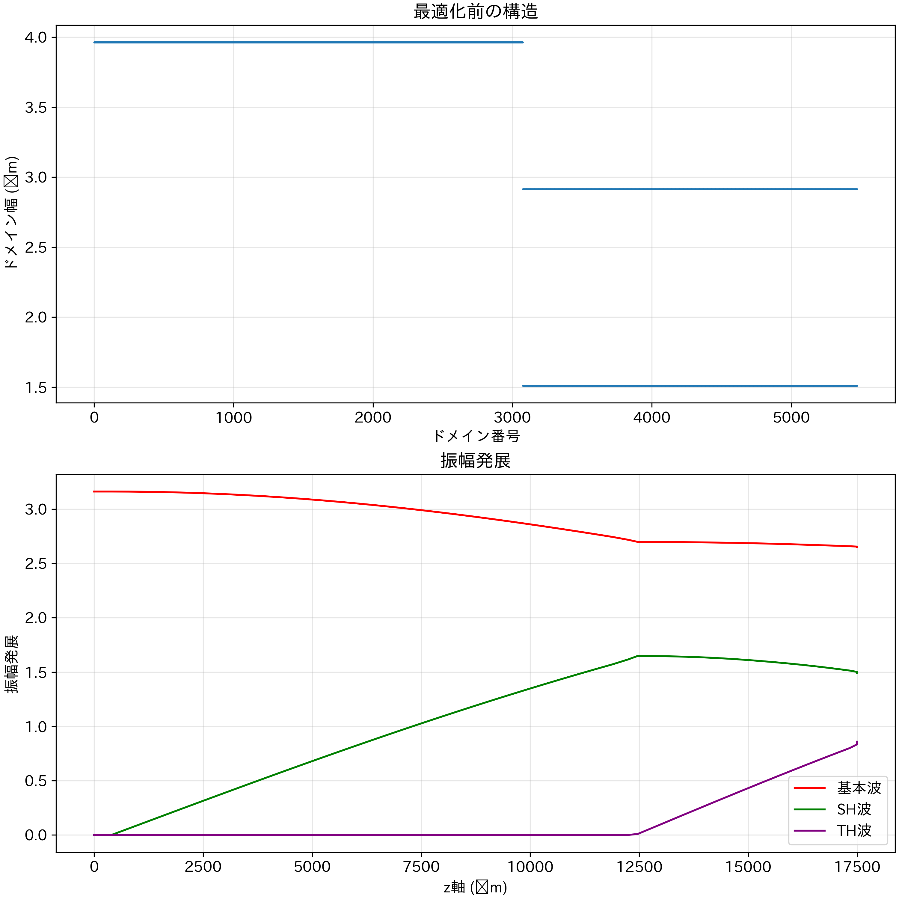
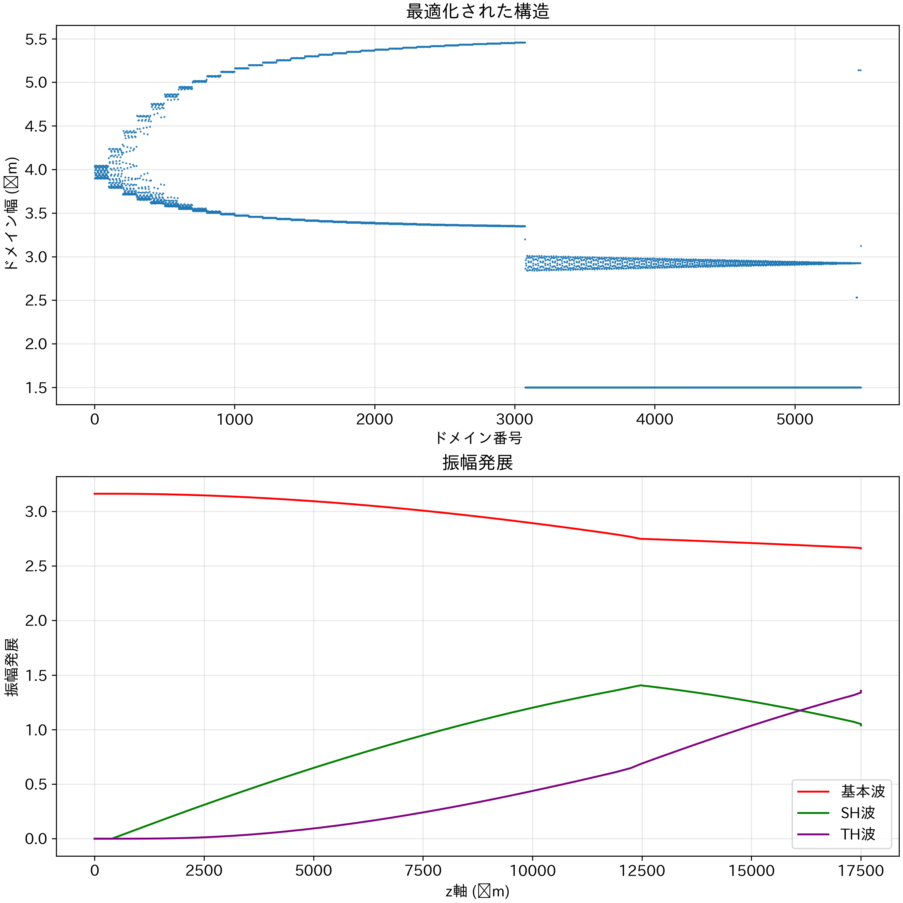

# 4.6 最適化された不規則周期変調構造における波長変換効率

SFGのためのQPM周期は約2\ \mu mであり、ドメイン幅にすると1 µmである。この幅の作製はとても難しいことが知られている。そこで、より広いドメイン幅のみで先行研究で目標とされていた1Wの出力1を得られる構造がないか、探索を行った。

## 4.6.1 最適化手法の改善

ランダムな最適化を行ったところ、複雑なエネルギー地形により、局所解に陥りやすいという問題があった。

### 1. 初期構造の物理的構築 (Split-based Initialization)
そこで、物理的に意味のある作製可能タンデム構造を初期値としした。具体的には、デバイス全長 $L$ に対する SHG 領域の割合（スプリット比 $s$）をパラメータとし、前半 $sL$ を SHG 用の周期的分極反転構造と設定する。この際、SHG に対するコヒーレンス長を $l_{c1}$ とすると、1次の QPM 周期 $\Lambda_{SHG} = 2 l_{c1}$ は約 $7.9 \mu\text{m}$ であり（$l_{c1} \approx 3.96 \mu\text{m}$）、作製制約（$w \ge 1.5 \mu\text{m}$）に対して十分な余裕を持って設計できる。

一方、後半 $(1-s)L$ は SFG 用の周期的分極反転構造とするが、ここには工夫が必要である。SFG に対するコヒーレンス長 $l_{c2} \approx 1.106 \mu\text{m}$ は非常に短いため、通常の1次 QPM 周期 $\Lambda_{SFG} = 2 l_{c2} \approx 2.21 \mu\text{m}$ を採用すると、各ドメイン幅は約 $1.1 \mu\text{m}$ となり、最小ドメイン幅制約（$1.5 \mu\text{m}$）を満たすことができない。

そこで、本手法では SFG 領域に対してあえて **2次の QPM 構造（$\Lambda_{SFG} \approx 4 l_{c2} \approx 4.426 \mu\text{m}$）** を初期値として採用した。一般に、$m$ 次の QPM における有効非線形定数 $d_{eff}$ は、デューティ比 $D = w / \Lambda$ に依存して以下のように表される。

$$
d_{eff} = d_{33} \frac{2}{m \pi} \sin(m \pi D)
$$

この式から分かるように、$m=2$ （偶数次）の場合、デューティ比 $D=0.5$ （50%）では $\sin(\pi) = 0$ となり、非線形性が消失してしまう。しかし、デューティ比を 0.5 からずらすことで、非ゼロの有効非線形性を回復させることができる。
本研究では、作製可能な最小幅 $1.5 \mu\text{m}$ 以上を確保できる範囲で、可能な限り高い変換効率を得るために非対称なデューティ比（$w_1 = 1.51 \mu\text{m}, w_2 \approx 2.92 \mu\text{m} \Rightarrow D \approx 0.34$）を設定した。この場合、$\sin(2\pi \times 0.34) \approx 0.84$ となり、理想的な1次 QPM には及ばないものの（係数 $1/m = 1/2$ の影響も含む）、十分に実用的な非線形性を初期段階から持たせることができる。

### 2. マルチスタート L-BFGS 法 (Multi-start L-BFGS)
上記のスプリット比 $s$ を $0.3 \sim 0.7$ の広範囲で走査し、複数の異なる初期構造に対して並列に準ニュートン法の一種である L-BFGS 法による最適化を行った。
これにより、単一の初期値に依存せず、多様な初期条件から出発することで、より高い変換効率を持つ解を発見することが可能となった。

さらに、作製プロセス上の制約を考慮し、ドメイン幅 $w$ に対して以下の変数変換を導入した。
$$
w = 1.5 + \text{softplus}(p)
$$
ここで、$p$ は最適化変数である。この変換により、最適化の過程で常にすべてのドメイン幅が $1.5 \mu\text{m}$ 以上となることが保証される。

## 4.6.2 結果と考察

前述の手法を用いて設計した最適化構造のシミュレーション結果を以下に示す。

最適化前の初期構造（スプリット比探索のみによる最良解）における規格化第三高調波振幅（$|A_{3\omega}|$）は **0.859** であった。これに対し、本手法による最適化後の構造では、振幅は **1.356** まで向上した。これは初期値と比較して約 **1.58倍** の改善であり、パワーは二乗に比例するため、**2.5倍**の改善である。

理想的な完全位相整合条件（Noroらの報告による理論限界値 1.704）には及ばないものの、$1.5 \mu\text{m}$ という厳しい最小ドメイン幅制約下において、高い変換効率を実現している点は特筆すべきである。最適化された構造は、単純なタンデム構造とは異なり、局所的に周期が揺らぐ不規則な変調構造となっている。この不規則性が、位相不整合を微細に補償し、SHG と SFG のバランスを動的に調整することで、全体としての変換効率を最大化していると考えられる。

*図 4.6.1: 最適化前の初期構造における振幅発展*

*図 4.6.2: 最適化された不規則周期変調構造における振幅発展*
